# Stipendium KIT

Von November 2022 bis Juni 2023 war ich Teil des Projektes Simulierte Welten des KIT. Dabei habe ich Klimadaten mit Python analysiert und ausgewertet. Folgende Bilder und Videos sind die Ergebnisse dieses Projektes:

### Temperaturverlauf innerhalb eines Jahres

![][Gifs/1970]
<gif src="Gifs/1970.gif">

<gif src="Gifs/2099.gif">

### Temperaturen nach Höhe und Längengrad im Verlauf der Jahre

<gif src="Gifs/Jahre.gif">

### Temperatur nach Höhe

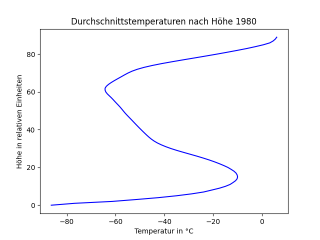

### Temperaturverlauf der verschiedenen Höhen

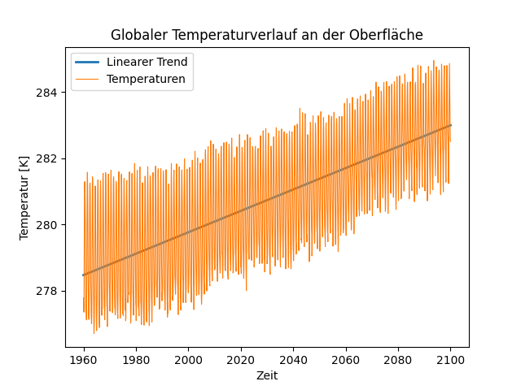

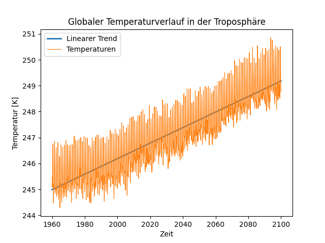

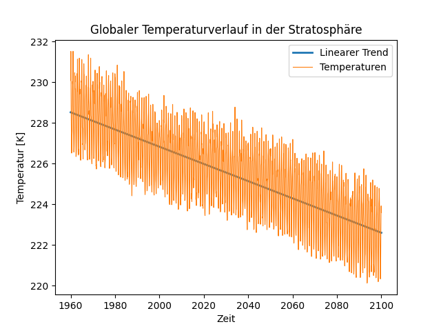

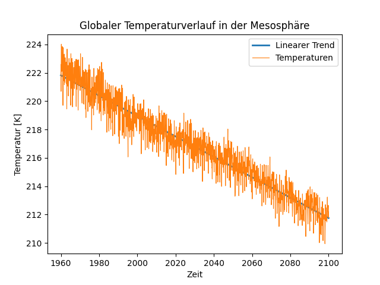

### Temperaturverlauf der verschiedenen Klimazonen

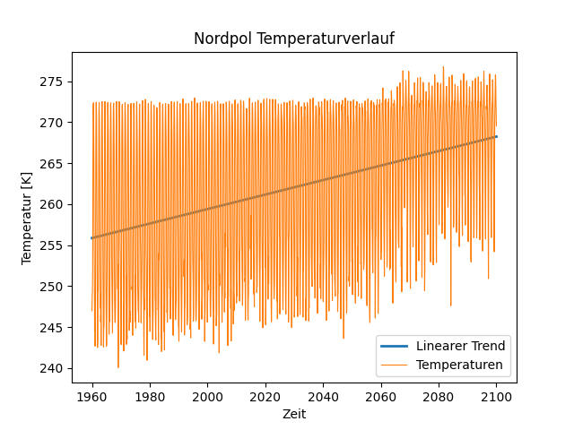

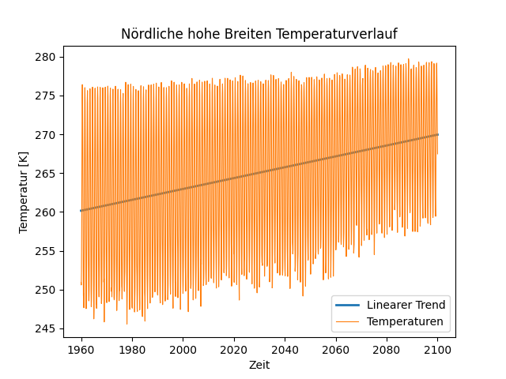

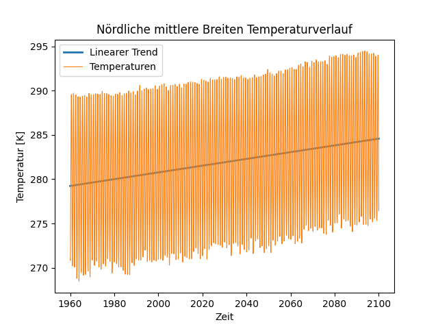

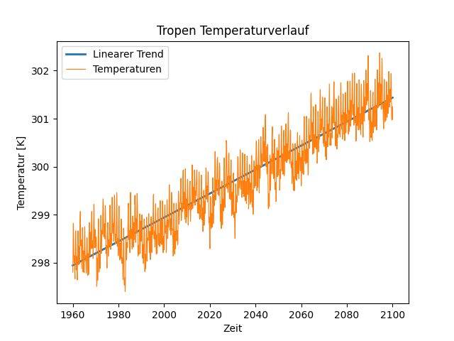

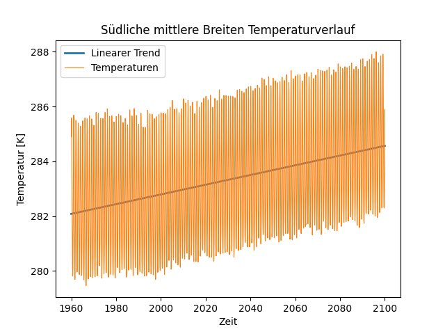

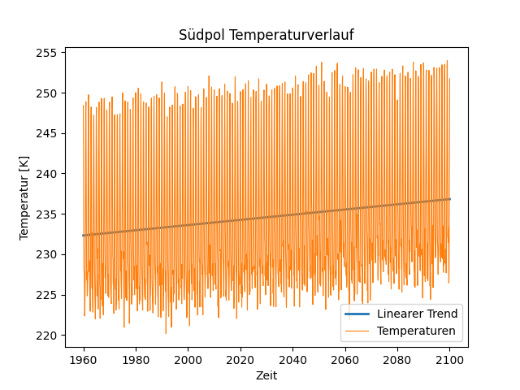
