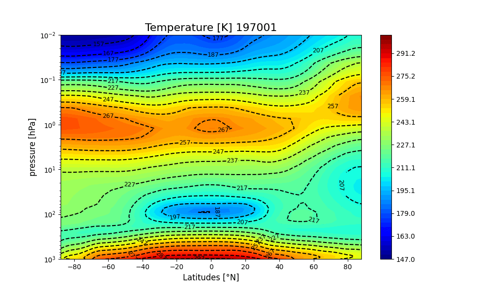
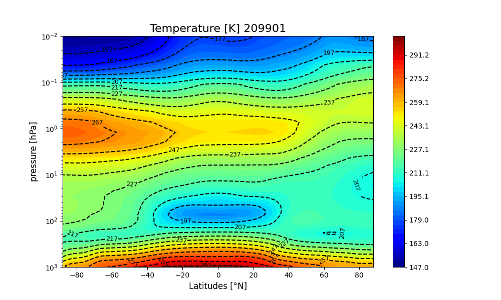
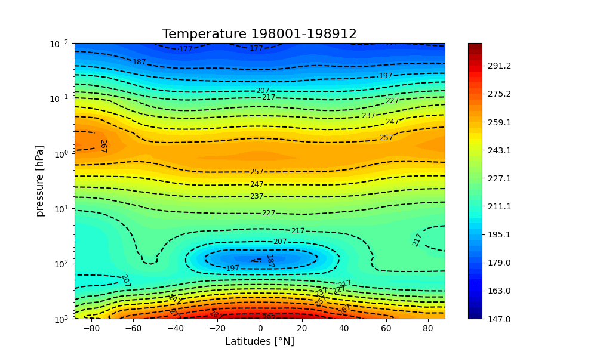
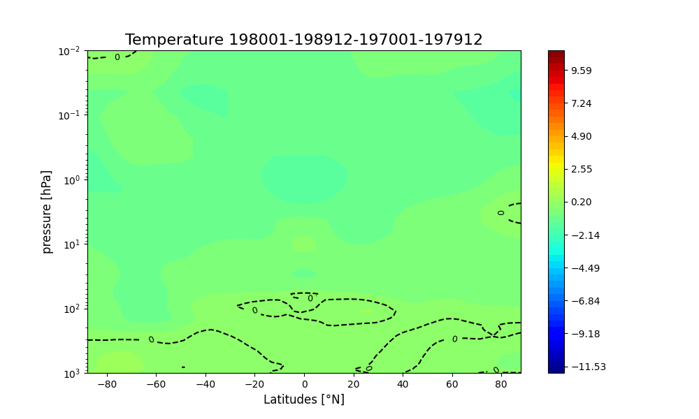
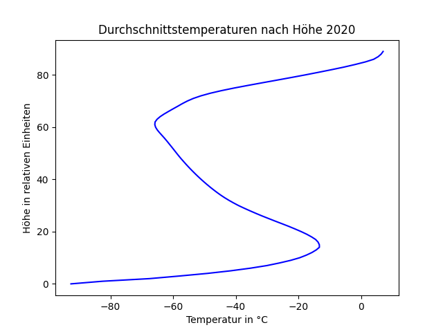
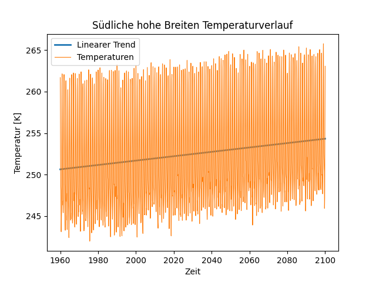

# Stipendium KIT

Von November 2022 bis Juni 2023 war ich Teil des Projektes Simulierte Welten des KIT. Dabei habe ich Klimadaten mit Python analysiert und ausgewertet. Folgende Bilder und Videos sind die Ergebnisse dieses Projektes:

## Temperaturverlauf innerhalb eines Jahres

## Temperaturen im Verlauf der Jahre

## Differenz in der Temperatur zu 1980

## Temperatur nach Höhe

## Temperaturverlauf der verschiedenen Höhen

## Temperaturverlauf der verschiedenen Klimazonen

